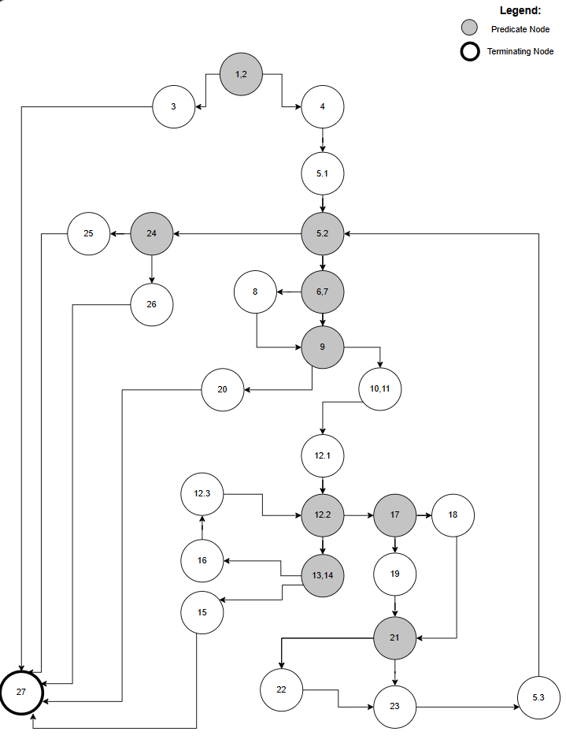
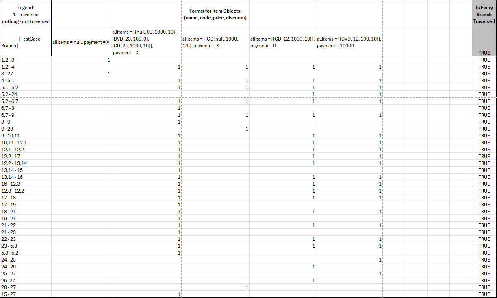
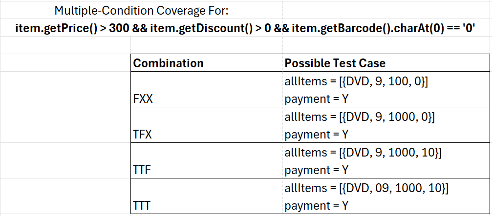

# Втора лабораториска вежба по Софтверско инженерство

___

## Виктор Костадиноски, бр. на индекс 226009

___

1. /
2. CFG на функцијата checkCart()
   
3. Цикломатската комплексност на CFG - от изнесува: __10__.
    - Еден од начините за нејзинот пресметување е:
        - цикломатскаКомплексност = бројНаПредикатниЈазли + 1.
        - Во случајот имаме 9 предикатни јазли -> цикломатската комплексност е 9 + 1 = __10__
4. Тест случаевите за Every Branch критериумот можеме да ги видиме во следната табела:
   
    - Ги имаме следните тест случаеви:
        - allItems = __null__, payment = __X__
            - Во овој тест случај allItems листате е null -> се фрла *RuntimeException* со порака *“allItems list can't
              be null!“*.
        - allItems = __[{null, 03, 1000, 10}, {DVD, 23, 100, 0}, {CD, 2a, 1000, 10}]__, payment = __X__
            - Во овој тест случај при првиот Item објект го исполнуваме условот името на Item-от да е null, условот
              Item - от да има намалување и условот Item - от да има намалување, неговата цена да е повеќе од 300 и
              првиот знак на баркодот да е 0. Со вториот Item, се исполнува условот Item - от да нема намалување и
              условот Item - от да нема намалување, неговата цена да не е повеќе од 300 и
              првиот знак на баркодот да не е 0. Со третиот Item, се фрла *RuntimeException* со порака *“Invalid
              character in item barcode!“*.
        - allItems = __[{CD, null, 1000, 10}]__, payment = __X__
            - Во овој тест случај Item - от има баркот = null ->  се фрла *RuntimeException* со порака *“No barcode!“*.
        - allItems = __[{CD, 12, 1000, 10}]__, payment = __0__
            - Во овој тест случај функцијата не фрла никакви исклучоци и завршува по нормален тек. Резултатот на
              функцијата е *false* бидејќи *payment* променливата има помала вредност од *sum* променливата.
        - allItems = __[{DVD, 12, 100, 10}]__, payment = __10000__
            - Во овој тест случај функцијата не фрла никакви исклучоци и завршува по нормален тек. Резултатот на
              функцијата е *true* бидејќи *payment* променливата има поголема вредност од *sum* променливата.
        - > Формат за Item објектите: {name, code, price, discount}
        - > X = која било вредност
5. Тест случаевите за Multiple-Contition критериумот можеме да ги видиме во следната табела:
   
    - Ги имаме следните тест случаеви:
        - allItems = __[{DVD, 9, 100, 0}]__, payment = __X__
            - Во овој тест случај, Item - от има цена помала од 300 -> условот нема да биде исполнет. Останатите
              примитиви воопшто нема да бидат пресметани како резултат на *Lazy Evaluation*.
        - allItems = __[{DVD, 9, 1000, 0}]__, payment = __X__
            - Во овој тест случај, Item - от има цена поголема од 300, но попустот е 0 -> условот нема да биде исполнет.
              Останатиот примитив воопшто нема да биде пресметан како резултат на *Lazy Evaluation*.
        - allItems = __[{DVD, 9, 1000, 10}]__, payment = __X__
            - Во овој тест случај, Item - от има цена поголема од 300, попустот е поголем од 0, но баркодот не започнува на 0 -> условот нема да биде исполнет.
        - allItems = __[{DVD, 09, 1000, 10}]__, payment = __X__
            - Во овој тест случај, Item - от има цена поголема од 300, попустот е поголем од 0 и баркодот започнува на 0 -> условот ќе биде исполнет.
        - > Формат за Item објектите: {name, code, price, discount}
        - > X = Примитиви коишто нема да се извршат како резултат на *Lazy Loading*
        - > Y = Која било вредност
        - > Секоја од вистинитосните вредности Т или F (или X) во колоната **Combinations** се однесува на по еден примитив од условот: *item.getPrice() > 300 && item.getDiscount() > 0 && item.getBarcode().charAt(0) == '0'*
6. /
